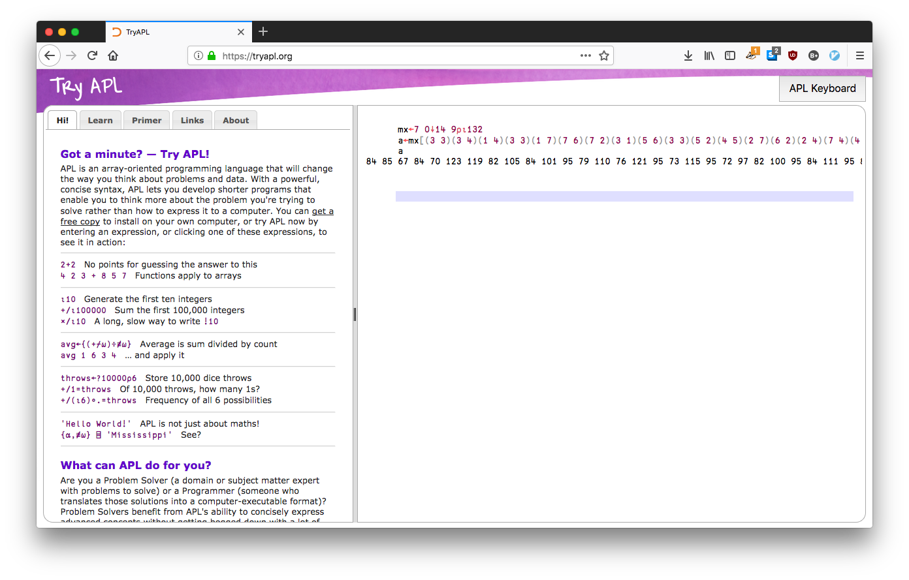

# TUCTF
## APL

### description:
Dr. W gave me an old program of his... Can you tell me what it does? 

(Difficulty: Easy)

[apl.txt](APL.txt)

To solve this challenge, some important context is knowing that APL is a fairly
dated programming language. A quick search brought me to 
[this APL interpreter](https://tryapl.org/)

I pasted the context of the text file like so:



looking at the value of the variable `a` gives this array:

```
84 85 67 84 70 123 119 82 105 84 101 95 79 110 76 121 95 73 115 95 72 97 82 100 95 84 111 95 82 101 65 100 125
```

converting all of these values into ascii characters is simple in python:

```
s = "84 85 67 84 70 123 119 82 105 84 101 95 79 110 76 121 95 73 115 95 72 97 82 100 95 84 111 95 82 101 65 100 125"
print ''.join([chr(int(x)) for x in s.split()])
```

which yields this:

`TUCTF{wRiTe_OnLy_Is_HaRd_To_ReAd}`


